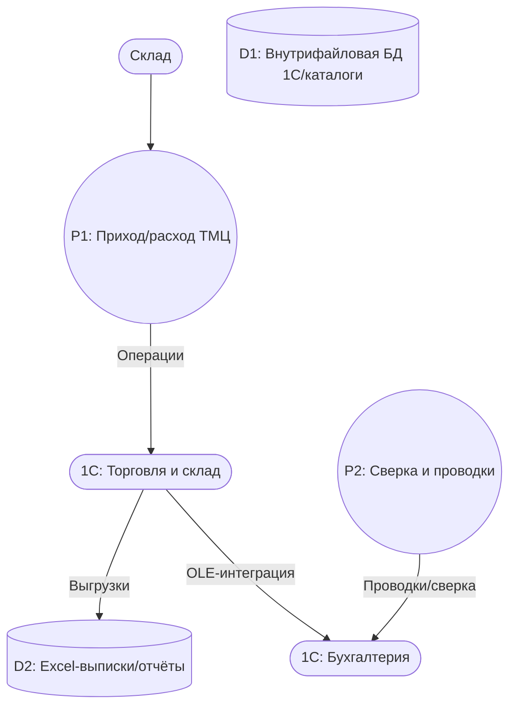

# DFD — Учёт ТМЦ и закупок (As‑Is)

```mermaid
flowchart TB

WARE([Склад])
ACC1C([1С: Торговля и склад])
FIN1C([1С: Бухгалтерия])
P1((P1: Приход/расход ТМЦ))
P2((P2: Сверка и проводки))

D1[(D1: Внутрифайловая БД 1С/каталоги)]
D2[(D2: Excel-выписки/отчёты)]

WARE --> P1
P1 -->|Операции| ACC1C
ACC1C -->|Выгрузки| D2
ACC1C -->|OLE-интеграция| FIN1C
P2 -->|Проводки/сверка| FIN1C
```
