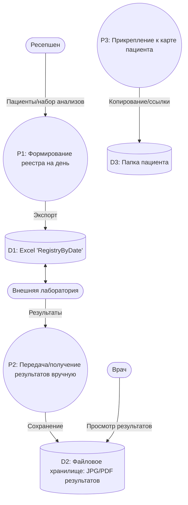

# DFD — Анализы и обмен с лабораторией (As‑Is)

```mermaid
flowchart TB

RECEPTION([Ресепшен])
LAB([Внешняя лаборатория])
DOCTOR([Врач])

P1((P1: Формирование реестра на день))
P2((P2: Передача/получение результатов вручную))
P3((P3: Прикрепление к карте пациента))

DREG[(D1: Excel 'RegistryByDate')]
DFILES[(D2: Файловое хранилище: JPG/PDF результатов)]
DPAT[(D3: Папка пациента)]

RECEPTION -->|Пациенты/набор анализов| P1
P1 -->|Экспорт| DREG
DREG <--> LAB
LAB -->|Результаты| P2
P2 -->|Сохранение| DFILES
P3 -->|Копирование/ссылки| DPAT
DOCTOR -->|Просмотр результатов| DFILES
```
