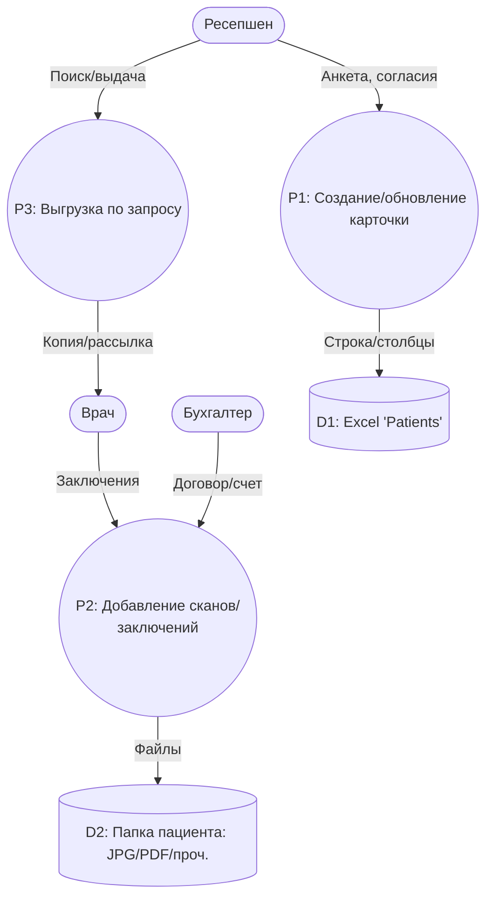

# DFD — Медкарты и файлы пациентов (As‑Is)

```mermaid
flowchart TB

RECEPTION([Ресепшен])
DOCTOR([Врач])
BOOKKEEPER([Бухгалтер])

P1((P1: Создание/обновление карточки))
P2((P2: Добавление сканов/заключений))
P3((P3: Выгрузка по запросу))

D1[(D1: Excel 'Patients')]
D2[(D2: Папка пациента: JPG/PDF/проч.)]

RECEPTION -->|Анкета, согласия| P1
P1 -->|Строка/столбцы| D1
DOCTOR -->|Заключения| P2
P2 -->|Файлы| D2
BOOKKEEPER -->|Договор/счет| P2
RECEPTION -->|Поиск/выдача| P3
P3 -->|Копия/рассылка| DOCTOR
```
