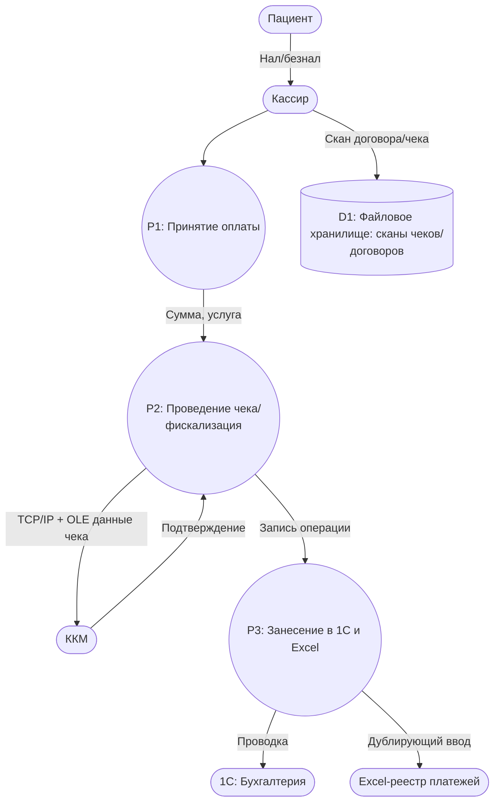

# DFD — Приём оплаты и учёт платежей (As‑Is)

```mermaid
flowchart TB

PATIENT([Пациент])
CASHIER([Кассир])
KKM([ККМ])
ACC1C([1С: Бухгалтерия])
EXCELPAY([Excel-реестр платежей])

P1((P1: Принятие оплаты))
P2((P2: Проведение чека/фискализация))
P3((P3: Занесение в 1С и Excel))

D1[(D1: Файловое хранилище: сканы чеков/договоров)]

PATIENT -->|Нал/безнал| CASHIER
CASHIER --> P1
P1 -->|Сумма, услуга| P2
P2 -->|TCP/IP + OLE данные чека| KKM
KKM -->|Подтверждение| P2
P2 -->|Запись операции| P3
P3 -->|Проводка| ACC1C
P3 -->|Дублирующий ввод| EXCELPAY
CASHIER -->|Скан договора/чека| D1
```
