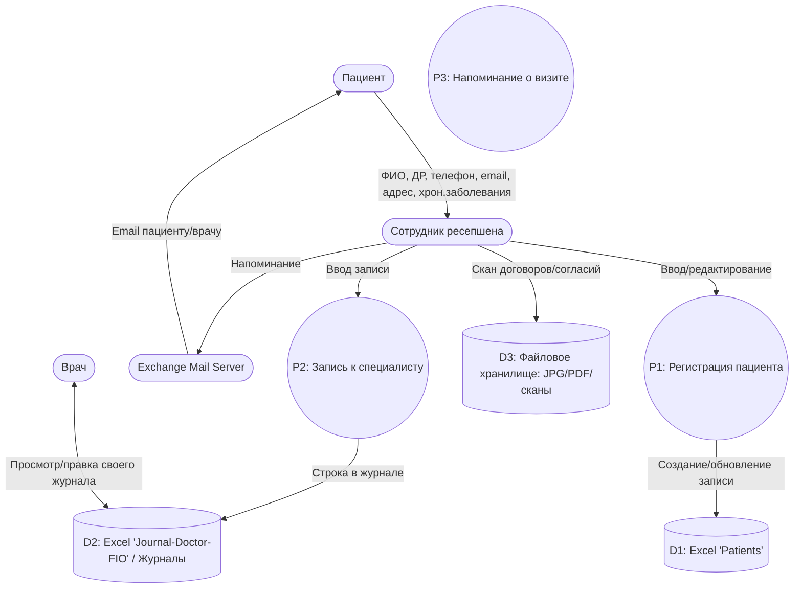

# DFD — Регистрация пациента и запись на приём (As‑Is)

```mermaid
flowchart TB

%% Внешние сущности
PATIENT([Пациент])
RECEPTION([Сотрудник ресепшена])
DOCTOR([Врач])
EXCHANGE([Exchange Mail Server])

%% Процессы
P1((P1: Регистрация пациента))
P2((P2: Запись к специалисту))
P3((P3: Напоминание о визите))

%% Хранилища
D1[(D1: Excel 'Patients')]
D2[(D2: Excel 'Journal-Doctor-FIO' / Журналы)]
D3[(D3: Файловое хранилище: JPG/PDF/сканы)]

%% Потоки данных
PATIENT -->|ФИО, ДР, телефон, email, адрес, хрон.заболевания| RECEPTION
RECEPTION -->|Ввод/редактирование| P1
P1 -->|Создание/обновление записи| D1
RECEPTION -->|Скан договоров/согласий| D3
RECEPTION -->|Ввод записи| P2
P2 -->|Строка в журнале| D2
DOCTOR <-->|Просмотр/правка своего журнала| D2
RECEPTION -->|Напоминание| EXCHANGE
EXCHANGE -->|Email пациенту/врачу| PATIENT
```
