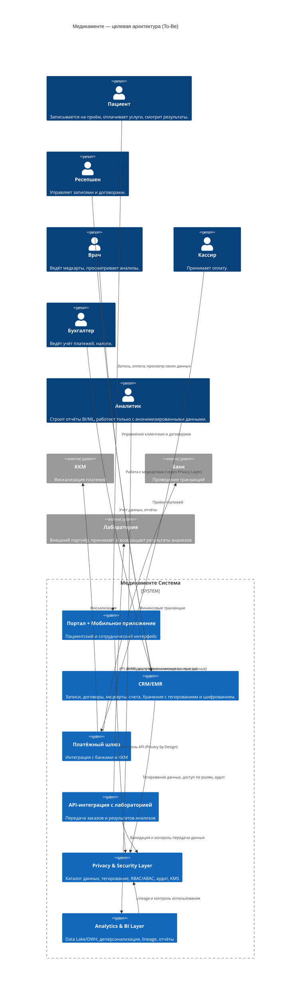

# C4 Context Diagram — To-Be (Privacy by Design)

```mermaid
C4Context
    title Медикаменте — целевая архитектура (To-Be)
    
    Person(patient, "Пациент", "Записывается на приём, оплачивает услуги, смотрит результаты.")
    Person(reception, "Ресепшен", "Управляет записями и договорами.")
    Person(doctor, "Врач", "Ведёт медкарты, просматривает анализы.")
    Person(cashier, "Кассир", "Принимает оплату.")
    Person(bookkeeper, "Бухгалтер", "Ведёт учёт платежей, налоги.")
    Person(analyst, "Аналитик", "Строит отчёты BI/ML, работает только с анонимизированными данными.")

    System_Boundary(medikamente, "Медикаменте Система") {
        System(portal, "Портал + Мобильное приложение", "Пациентский и сотруднический интерфейс")
        System(crm, "CRM/EMR", "Записи, договоры, медкарты, счета. Хранение с тегированием и шифрованием.")
        System(pay, "Платёжный шлюз", "Интеграция с банками и ККМ")
        System(lab_api, "API-интеграция с лабораторией", "Передача заказов и результатов анализов")
        System(audit, "Privacy & Security Layer", "Каталог данных, тегирование, RBAC/ABAC, аудит, KMS")
        System(bi, "Analytics & BI Layer", "Data Lake/DWH, деперсонализация, lineage, отчёты")
    }

    System_Ext(kkm, "ККМ", "Фискализация платежей")
    System_Ext(bank, "Банк", "Проведение транзакций")
    System_Ext(lab, "Лаборатория", "Внешний партнёр, принимает и возвращает результаты анализов")

    Rel(patient, portal, "Запись, оплата, просмотр своих данных")
    Rel(reception, crm, "Управление клиентами и договорами")
    Rel(doctor, crm, "Работа с медкартами (через Privacy Layer)")
    Rel(cashier, pay, "Приём платежей")
    Rel(bookkeeper, crm, "Учёт данных, отчёты")
    Rel(analyst, bi, "BI/ML доступ (анонимизированные данные)")

    Rel(pay, kkm, "Фискализация")
    Rel(pay, bank, "Финансовые транзакции")

    Rel(crm, audit, "Тегирование данных, доступ по ролям, аудит")
    Rel(portal, audit, "Контроль API (Privacy by Design)")
    Rel(lab_api, lab, "API-интеграция (ограниченные контракты)")
    Rel(lab_api, audit, "Валидация и контроль передачи данных")
    Rel(bi, audit, "Lineage и контроль использования")
```
